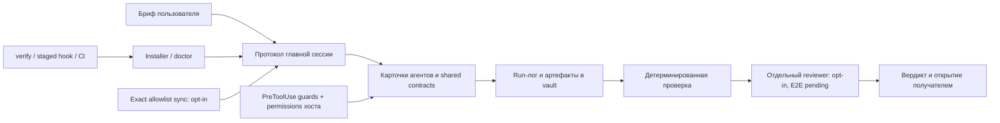

# Архитектура и границы

Сильная сторона — явная передача артефактов, роли автора/ревьюера и стандарты готовности. Слабость — часть контроля существует только в тексте: соблюдение волн, реальный бюджет, завершение проверки и report-only доступ должны подтверждаться runtime evidence.

После hardening слой выполнения отделён от PowerShell: shared Python guard, отдельные sync/export/installer/doctor. Sync не создаёт бесконтрольный автокоммит всей личной папки. Export не зеркалит project trees. Входной AGENTS.md описывает правила работы с public distribution; CLAUDE.md остаётся шаблоном установки.

## Ключевые решения

| Решение | Причина | Цена |
|---|---|---|
| Python stdlib для core | Чистый checkout без pip-сети | Ограниченный frontmatter parser |
| Exact manifest + FF-only | Контроль публикации и сохранение истории | Новые файлы требуют review manifest; divergence вручную |
| Opt-in export и acceptance | Предсказуемые побочные эффекты | Нужна явная настройка |
| Синтетические временные репозитории | Независимость тестов от личного стека | Не доказывают реальную SSH/CI среду |
| Минимальный профиль | Быстро проверить ядро | Не весь roster доступен |

## Сохранённый долг

Карточки содержат личные интеграционные ожидания, некоторые plugin paths и широкие обязанности. Линтер пропускает 17 предупреждений исходной копии; это главным образом отсутствующие локальные зависимости и пути, но каждое нужно закрывать по выбранному install profile. Отдельный live preflight должен отличать optional role от обязательного компонента конкретного задания.

Документация не превращает heuristic guard в sandbox; роль получателя и независимого проверяющего остаётся необходимой. Масштабный рефакторинг протокола без сравнительных прогонов отложен.

## Методологическая опора

- Основной фреймворк: NIST SSDF 1.1, NIST, 2022 — риск, проверка, доказательство и управление остаточным риском.
- Дополнительная модель: SLSA 1.2, 2025 — направление контроля цепочки поставки; уровень SLSA не заявляется.
- Источники: [NIST SSDF](https://csrc.nist.gov/projects/ssdf), [SLSA 1.2](https://slsa.dev/spec/v1.2/), [Claude Code hooks](https://code.claude.com/docs/en/hooks).
- Дата проверки актуальности: 2026-09-06. Оценочная шкала и веса взяты из пользовательского аудиторского брифа; баллы — экспертная оценка, не стандарт NIST.
